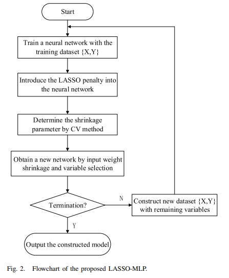

# nlp_lasso

Esse projeto explora a aplicação da regressão LASSO em uma rede neural MLP (multilayer Perceptron) para selecionar apenas as variáveis essenciais para o modelo, visando melhorar o desempenho da rede. O objetivo do trabalho é comparar o desempenho entre redes neurais com LASSO e sem LASSO dentro do escopo de NLP.

### Estudantes
* [Ana Carolina Souza](https://github.com/acsouza2398)
* [Livia Tanaka](https://github.com/liviatanaka)

## 1. Replicação do paper
O projeto teve como referência o artigo [Design and Application of a Variable Selection Method for Multilayer Perceptron Neural Network With LASSO](https://ieeexplore.ieee.org/document/7444176). O objetivo era replicar os métodos para alcançar os resultados apresentados no estudo. A estrutura da rede MLP utilizada era composta por três camadas: a de entrada, a de saída e a "oculta", que era ativada por uma função tangente hiperbólica. Essa rede passou pelo seguinte processo (Algorithm 2 LASSO-MLP, no paper):

    1. Treinamento inicial da rede neural com o otimizador Adam;
    2. Introdução da penalidade LASSO;
    3. Determinação do parâmetro de redução (shrinkage paramter) λ através do método de validação cruzada k-fold;
    4. Eliminação das variáveis de entrada com peso 0;

    Repetição do processo até que não haja nenhuma variável de peso 0.

 

 Fonte: [Design and Application of a Variable Selection Method for Multilayer Perceptron Neural Network With LASSO](https://ieeexplore.ieee.org/document/7444176)

 

O algoritmo do K-fold também foi descrito no paper (Algorithm 1 K-fold CV for the determination of λ, no paper):

    1. Inicialize o domínio do parâmetro λ em [λ_lb, λ_ub], onde: λ_lb = 0 e λ_ub é um valor suficientemente grande que garante que todos os coeficientes estimados (β^) sejam iguais a zero. Defina λ = λ_lb.
    2. Separe o conjunto de dados completo S = {X, Y} em K sub-conjuntos disjuntos: S1, S2, ..., SK.
    3. Validação Cruzada
    4. Atualize λ para λ + Δλ. Se λ ≤ λ_ub, volte para o Passo 3.
    5. Encontre o λ ótimo que minimiza o erro de validação cruzada.

Para comparar a replicação, foi utilizado o mesmo dataset do artigo, o [Pumadyn32hn](https://www.cs.utoronto.ca/~delve/data/pumadyn/desc.html). Contudo, foram obtidos resultados diferentes do esperado, com um RMSE maior do que o relatado e um $R^2$ score menor. Ao analisar a implementação, notou-se que os pesos dos parâmetros de entrada estavam sofrendo alterações mínimas, o que inviabilizou o treinamento adequado da rede. Foram realizadas diversas alterações no modelo do artigo em busca de melhoria, porém não foi obtido sucesso em nenhuma delas. É interessante notar que ao seguir um tutorial do [Geeks For Geeks L1L2 Regularization](https://www.geeksforgeeks.org/l1l2-regularization-in-pytorch/) para tentar limpar e corrigir a replicação do paper, os mesmos problemas dos pesos não se alterando aconteceu. Frente esses problemas, optou-se por utilizar a implementação da [regularização L1 do PyTorch](https://pytorch.org/docs/stable/generated/torch.nn.utils.prune.l1_unstructured.html) para aplicar a técnica.

A replicação pode ser vista no notebook [paper_recreation.ipynb](paper_recreation.ipynb) e a implementação com o Pytorch está em [new_implementation.ipynb](new_implementation.ipynb).

## 2. Aplicação em NLP

Visando aplicar tal técnica em um contexto de NLP, a base de dados usada na [new_implementation.ipynb](new_implementation.ipynb)  foi [Wiki Movie Plots](https://raw.githubusercontent.com/tiagoft/NLP/main/wiki_movie_plots_drama_comedy.csv) com embeddings gerados usando o SBERT (Sentence-BERT), especificamente com o modelo `all-MiniLM-L6-v2`, implementado na biblioteca `sentence-transformers`.

Para fazer a comparação de eficência entre o modelo do paper, o código fonte da [APS 2](https://github.com/acsouza2398/pkmncards_scrapper/tree/aps2) foi usada e, por se tratar de um problema de regressão, o $R^2$ e o MSE entre os modelos foram comparados.

Usando o LASSO MLP, o seu $R^2$ ficou 0.8673 e o MSE ficou 0.0003. Já a implementação da APS2, com autoencoder, o seu $R^2$ ficou 0.1206 e o seu MSE 0.001. 

O modelo com o autoencoder teve menos perdas do que a implementação de LASSO, mostrando que o autoencoder conseguiu reconstruir melhor os encoders, mas ainda sim a perda de ambos os models é baixa.

Ao comparar o $R^2$, percebe-se que o LASSO MLP teve um número maior, porém pode-se suspeitar de overfitting dos dados. Já o modelo com autoencoder, o $R^2$ deu baixo em comparação, com baixo poder explicativo dos dados, o que faz sentido ao se considerar que o propósito do autoencoder não é regredir os dados, mas sim reduzir as dimensões dos dados e compressão.

## Conclusão
LASSO aplicado a NLP pode ser mais útil para análise de sentimentos, por exemplo, a fim de escolher os melhores termos ou as frases mais relevantes sobre o objeto de estudo. Considerando o caso de uso da APS2, não é uma boa aplicação considerando que não há escolha relevante de features a ser feita com o autoencoder, portanto o algoritmo do L1 não é relevante nesse caso.
